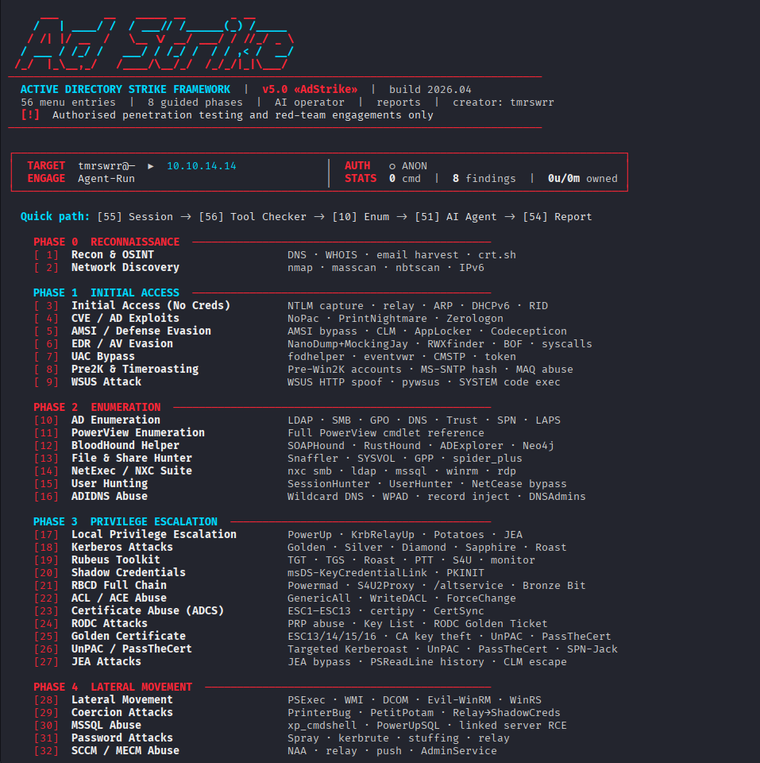

<div align="center">


<h1>AdStrike &mdash; <code>v5.0 «AdStrike»</code></h1>
<p><strong>Professional Active Directory Attack Framework</strong></p>

[](https://python.org)
[](https://www.kali.org)
[](modules/)
[]()
[]()
[](LICENSE)
[](https://github.com/capture0x)

**Authorized use only. Do not run this tool against systems without explicit written permission.**

Release status: beta/research build. Menu and import health checks pass; individual modules still depend on target state, credentials, network reachability, and installed third-party tools.



</div>

---

## Overview

AdStrike is a modular, terminal-based Active Directory attack framework. It helps operators move through discovery, enumeration, exploitation, credential access, lateral movement, persistence, and reporting while keeping session state in one place.

The framework stores target details, credentials, Kerberos state, findings, executed commands, and output paths in a shared session. Modules can reuse that context instead of forcing the operator to re-enter the same data repeatedly.

Core capabilities:

- 56 interactive menu entries: 50 attack modules, 4 utilities, 2 management functions
- 9 kill-chain phase groups, from reconnaissance through advanced operations
- Kerberos-aware workflows for NTLM-disabled and LDAP-signing-enforced environments
- Smart Analyst for parsing output and ranking next actions
- Optional AdStrike Agent for AI-assisted planning or tool orchestration
- Report generation in HTML, Markdown, and JSON
- Wrappers for common AD tooling such as Impacket, NetExec, Certipy, Kerbrute, BloodHound, PowerView, Rubeus, and related utilities

---

## Screenshots

| AD Enumeration | BloodHound Helper |
|---|---|
|  |  |

| AdStrike Agent | Smart Analyst |
|---|---|
|  |  |

---

## Quick Start

```bash
git clone https://github.com/capture0x/AdStrike.git
cd AdStrike
chmod +x install.sh run.sh
bash install.sh
bash run.sh
```

Do not run `install.sh` or `run.sh` with `sudo`. The installer creates repo-local files such as `adrt_venv/`, `.env`, and `output/`; running as root can leave those files root-owned.

If you already ran it with `sudo`, fix ownership once:

```bash
sudo chown -R "$(id -un):$(id -gn)" .
```

---

## Requirements

| Item | Requirement |
|---|---|
| OS | Kali Linux 2024+ or Parrot OS recommended |
| Python | 3.10 or higher |
| Privileges | Normal user for the framework; root only for tools that require packet capture or privileged network actions |
| Network | Reachability to in-scope AD services, commonly 88, 389, 443, 445, 636, 5985 |

Key external tools:

```text
impacket-scripts    nxc / netexec       bloodhound-python    certipy-ad
evil-winrm          kerbrute            responder            ldap-utils
hashcat             john                nmap / masscan       krb5-user
dnstool.py          dig                 ldapsearch
```

Most dependencies are installed by `install.sh`. Some optional tools are installed or repaired by `scripts/repair_tools.sh` when possible.

---

## Configuration

The installer copies `.env.example` to `.env`. Edit `.env` before an engagement:

```env
DC_IP=10.10.10.10
DC_FQDN=dc1.corp.local
DOMAIN=corp.local
BASE_DN=DC=corp,DC=local
USERNAME=user
PASSWORD=
NT_HASH=
USE_KERBEROS=false
KRB5_CCACHE=
ATTACKER_IP=10.10.14.5
ATTACKER_IFACE=tun0
ENGAGEMENT_NAME=Corp-Internal-2026
ADSTRIKE_SHOW_SECRETS=false
```

You can also enter these values interactively from the Session Manager. The session carries them across modules automatically.

Never commit real engagement data. Keep `.env`, `output/`, ticket files, hashes, dumps, reports, and captured loot private and redacted.

Useful environment flags:

| Variable | Default | Purpose |
|---|---:|---|
| `ADSTRIKE_SHOW_SECRETS` | `false` | Mask passwords, hashes, and loot in logs and reports unless explicitly enabled |
| `ADSTRIKE_NO_ANIMATION` | unset | Disable startup animation for cleaner logs or slow terminals |
| `ADSTRIKE_PORT_CHECK` | unset | Force quick nmap AD port check during session setup |
| `TGT_AUTO_RENEW` | `true` | Keep Kerberos renewal behavior enabled where supported |
| `ADSTRIKE_OPSEC` | `normal` | Agent mode override: `loud`, `normal`, or `stealth` |
| `ADSTRIKE_BH_HOST` | unset | BloodHound/Agent hostname override |
| `ADSTRIKE_BH_DOMAIN` | unset | BloodHound/Agent domain override |
| `ADSTRIKE_BH_IP` | unset | BloodHound/Agent DC IP override |
| `ANTHROPIC_API_KEY` | unset | Optional Claude backend key for AdStrike Agent |

---

## Usage

Start the interactive menu:

```bash
bash run.sh
```

Recommended first-run flow:

```text
[55] Session Manager  -> configure target and credentials
[56] Tool Checker     -> verify external tools and module imports
[10] AD Enumeration   -> collect baseline LDAP/SMB/GPO data
[52] Smart Analyst    -> parse output and rank next steps
[54] Generate Report  -> export findings and evidence
```

Direct module execution:

```bash
python -m venv venv     
source venv/bin/activate
python3 main.py --module 10
python3 main.py --module 56 --no-banner
python3 main.py --session output/session.json --no-banner
```

Health check:

```bash
python3 -m py_compile main.py
python3 main.py --check
```

Current local health check:

```text
Menu numbering is contiguous and unique
Module health OK: 54/54
```

---

## Module Map

| Phase | Menu Range | Area |
|---|---:|---|
| 0 | 1-2 | Reconnaissance |
| 1 | 3-9 | Initial access |
| 2 | 10-16 | Enumeration |
| 3 | 17-27 | Privilege escalation |
| 4 | 28-32 | Lateral movement |
| 5 | 33-36 | Credential access |
| 6 | 37-42 | Persistence |
| 7 | 43-46 | Cloud / hybrid |
| 8 | 47-50 | Advanced operations |
| Utilities | 51-56 | Agent, Analyst, Kerberos Manager, reporting, sessions, tool checking |

### Reconnaissance

| # | Module | Coverage |
|---|---|---|
| 1 | Recon & OSINT | DNS, WHOIS, email harvest, certificate transparency |
| 2 | Network Discovery | nmap, masscan, nbtscan, netdiscover, IPv6 scanning |

### Initial Access

| # | Module | Coverage |
|---|---|---|
| 3 | Initial Access (No Creds) | NTLM capture, relay, ARP, DHCPv6, RID cycling |
| 4 | CVE / AD Exploits | NoPac, PrintNightmare, Zerologon |
| 5 | AMSI / Defense Evasion | AMSI bypass, CLM bypass, AppLocker, obfuscation |
| 6 | EDR / AV Evasion | NanoDump, MockingJay, RWXfinder, BOF, syscalls |
| 7 | UAC Bypass | fodhelper, eventvwr, CMSTP, token impersonation |
| 8 | Pre2K & Timeroasting | Pre-Win2K accounts, MS-SNTP hash, MAQ abuse |
| 9 | WSUS Attack | WSUS HTTP spoofing, pywsus, SYSTEM execution |

### Enumeration

| # | Module | Coverage |
|---|---|---|
| 10 | AD Enumeration | LDAP, SMB, GPO, DNS, trusts, SPNs, LAPS, delegation |
| 11 | PowerView Enumeration | PowerView cmdlet reference and execution |
| 12 | BloodHound Helper | SOAPHound, RustHound, ADExplorer, Neo4j queries |
| 13 | File & Share Hunter | Snaffler, SYSVOL, GPP, spider_plus |
| 14 | NetExec / NXC Suite | SMB, LDAP, MSSQL, WinRM, RDP |
| 15 | User Hunting | SessionHunter, UserHunter, PSRemoting admin checks |
| 16 | ADIDNS Abuse | Wildcard DNS, WPAD, record injection, DNSAdmins |

### Privilege Escalation

| # | Module | Coverage |
|---|---|---|
| 17 | Local Privilege Escalation | PowerUp, KrbRelayUp, Potato attacks, JEA |
| 18 | Kerberos Attacks | AS-REP roast, Kerberoast, PtT, OPtH, tickets, PKINIT |
| 19 | Rubeus Toolkit | TGT, TGS, roasting, PTT, S4U, monitor mode |
| 20 | Shadow Credentials | msDS-KeyCredentialLink, pywhisker, PKINIT |
| 21 | RBCD Full Chain | Powermad, S4U2Proxy, altservice, Bronze Bit |
| 22 | ACL / ACE Abuse | GenericAll, WriteDACL, ForceChangePassword, AddMember |
| 23 | Certificate Abuse (ADCS) | ESC1-ESC13, Certipy, CertSync, CA enumeration |
| 24 | RODC Attacks | PRP abuse, Key List Attack, RODC Golden Ticket |
| 25 | Golden Certificate | CA key theft, UnPAC, PassTheCert |
| 26 | UnPAC / PassTheCert | Targeted Kerberoast, UnPAC, PassTheCert, SPN-Jack |
| 27 | JEA Attacks | JEA bypass, PSReadLine history, CLM escape |

### Lateral Movement

| # | Module | Coverage |
|---|---|---|
| 28 | Lateral Movement | PSExec, WMIExec, SMBExec, DCOM, Evil-WinRM, WinRS |
| 29 | Coercion Attacks | PrinterBug, PetitPotam, DFSCoerce, relay paths |
| 30 | MSSQL Abuse | xp_cmdshell, PowerUpSQL, linked servers, UNC capture |
| 31 | Password Attacks | Spray, Kerbrute, credential stuffing, relay capture |
| 32 | SCCM / MECM Abuse | NAA credential theft, relay, client push, AdminService |

### Credential Access

| # | Module | Coverage |
|---|---|---|
| 33 | Credential Dumping | LSASS, SAM, NTDS, lsassy, nanodump, pypykatz |
| 34 | DPAPI & Credential Vault | dploot, SharpDPAPI, LaZagne, KeeThief, browsers |
| 35 | DCSync / DCShadow | Domain hash dumping and rogue DC operations |
| 36 | Shadow Copies Abuse | VSS, NTDS.dit, SAM, SYSTEM hive extraction |

### Persistence

| # | Module | Coverage |
|---|---|---|
| 37 | Domain Persistence | Golden/Silver tickets, AdminSDHolder, NPPSPY, TTL group membership |
| 38 | Local Persistence | SharPersist, WMI subscriptions, registry, startup |
| 39 | GPO Abuse | GPO creation, linking, scheduled task execution, hijack |
| 40 | DNSAdmins Abuse | DLL injection through DNS service configuration |
| 41 | Trust Attacks | TrustKey, SID History, PAM trust, cross-forest escalation |
| 42 | AD Misc Abuse | Backup Operators, Skeleton Key, Exchange RBAC, DSRM |

### Cloud / Hybrid

| # | Module | Coverage |
|---|---|---|
| 43 | Azure AD / Entra ID | AADConnect, PTA, PHS, PRT, token theft |
| 44 | Entra Hybrid Attacks | MSOL DCSync, Device Code flow, PTA injection |
| 45 | gMSA Attacks | Enumeration, hash extraction, pass-the-hash, shadow credentials |
| 46 | ADFS & Golden SAML | Token signing certificate, Golden SAML, AADInternals |

### Advanced Operations

| # | Module | Coverage |
|---|---|---|
| 47 | Exploit Chains | Pre-built full attack paths |
| 48 | C2 Integration | Sliver, Havoc, Metasploit, Cobalt Strike payload delivery |
| 49 | Loot Parser & Analyzer | Parse, deduplicate, score, and export loot |
| 50 | AD Advanced Playbook | WDAC, MDE/MDI, WMI filters, trusts, deception |

### Utilities

| # | Utility | Purpose |
|---|---|---|
| 51 | AdStrike Agent (AI) | Optional AI-assisted planner/orchestrator |
| 52 | Smart Analyst | Parse output, build an attack plan, optionally execute steps |
| 53 | Kerberos Manager | TGT, PTT, S4U, ccache, kirbi, krb5.conf management |
| 54 | Generate Report | HTML, Markdown, and JSON reporting |
| 55 | Session Manager | Save, load, switch, and clear sessions |
| 56 | Tool Checker | Verify external tools and module imports |

---

## Output

Runtime files are written under `output/`:

| Path | Purpose |
|---|---|
| `output/session.json` | Persisted session state |
| `output/session_*.log` | Launcher logs from `run.sh` |
| `output/enum/` | LDAP, SMB, GPO, and enumeration artifacts |
| `output/bloodhound/` | BloodHound collections and related data |
| `output/audit/capability_audit.json` | Tool Checker and module health snapshot |
| `output/agent_logs/` | AdStrike Agent Markdown/JSON run logs |
| `output/agent_runtime/` | Kerberos config, ccache, hashes, and temporary agent artifacts |
| `output/reports/` | Generated reports |

Review and redact everything in `output/` before sharing.

---

## Automatic Target Discovery

During first-run session setup, entering a DC IP triggers a fast discovery pass:

1. LDAP rootDSE query to derive `DOMAIN`, `BASE_DN`, and `DC_FQDN` when available.
2. NetExec SMB fallback when LDAP does not reveal the domain.
3. Optional quick nmap check of common AD ports.

Force the port check:

```bash
ADSTRIKE_PORT_CHECK=true bash run.sh
```

If a DC FQDN is discovered, AdStrike prints an `/etc/hosts` line for environments where DNS resolution is unreliable. If clock skew is detected, it prints a time-sync hint before Kerberos-heavy workflows.

---

## Kerberos and NTLM-Disabled Environments

For targets where NTLM is disabled or unreliable, use:

```text
[18] Kerberos Attacks -> [A] NTLM-Disabled Attack Workflow
```

This workflow can:

- Generate target-specific `krb5.conf`
- Add the DC FQDN mapping guidance
- Request a TGT with Impacket
- Set `KRB5CCNAME` and `KRB5_CONFIG`
- Enable Kerberos mode for later modules
- Print ready-to-use Kerberos commands for NetExec, Impacket, BloodHound, and Evil-WinRM

Common Kerberos checks:

```bash
date
klist
cat "$KRB5_CONFIG"
echo "$KRB5CCNAME"
```

---

## AdStrike Agent

AdStrike Agent is optional. Manual modules do not require AI.

Supported backends:

| Backend | Use Case | Requirement |
|---|---|---|
| Ollama | Local/private/offline lab usage | `ollama serve`, local model, Python `requests` |
| Claude | API-backed reasoning | `ANTHROPIC_API_KEY`, internet/API access |

Ollama example:

```bash
ollama serve
ollama pull mistral
bash run.sh
# choose [51] AdStrike Agent (AI)
# choose Backend [1] Ollama
```

Claude example:

```bash
export ANTHROPIC_API_KEY="sk-ant-..."
bash run.sh
# choose [51] AdStrike Agent (AI)
# choose Backend [2] Claude
```

Agent modes:

| Mode | Meaning |
|---|---|
| Full Auto | Agent executes tool calls and adapts to evidence |
| Plan Only | Agent produces a prioritized plan without executing tools |

OPSEC modes:

| Mode | Meaning |
|---|---|
| Loud | Fast lab/CTF mode |
| Normal | Balanced internal pentest mode; default |
| Stealth | More conservative native-first behavior where possible |

---

## Repair and Troubleshooting

Check installed tools and module imports:

```bash
python3 main.py --module 56 --no-banner
```

Repair missing tools where possible:

```bash
bash scripts/repair_tools.sh --check
bash scripts/repair_tools.sh -y
```

Scoped repairs:

```bash
bash scripts/repair_tools.sh --no-apt
bash scripts/repair_tools.sh --no-pip
bash scripts/repair_tools.sh --no-github
```

If the virtual environment is missing:

```bash
bash install.sh
source adrt_venv/bin/activate
python3 main.py --check
```

If NetExec or Impacket fails, verify versions and rerun the repair script:

```bash
which nxc
nxc --version
which impacket-secretsdump
bash scripts/repair_tools.sh -y
```

If reports include sensitive values, confirm redaction is enabled:

```env
ADSTRIKE_SHOW_SECRETS=false
```

Then review `.env`, `output/session.json`, and generated reports manually before sharing.

---

## Documentation

Additional guide:

- [AdStrike and Agent Guide](docs/ADSTRIKE_AND_AGENT_GUIDE.md)

Security policy:

- [SECURITY.md](SECURITY.md)

License:

- [GPLv3](LICENSE)

---

## Legal Disclaimer

This software is provided for authorized security testing, red team engagements, and educational purposes only.

Use against systems without explicit written authorization from the system owner is illegal and may violate the Computer Fraud and Abuse Act (CFAA), the Computer Misuse Act (CMA), and equivalent laws in your jurisdiction.

The author accepts no liability for damage, data loss, service disruption, or legal consequences arising from misuse.

---

## Developer

**tmrswrr** - GitHub: [capture0x](https://github.com/capture0x)

Maintained for authorized offensive security research, lab validation, and professional red team operations.
